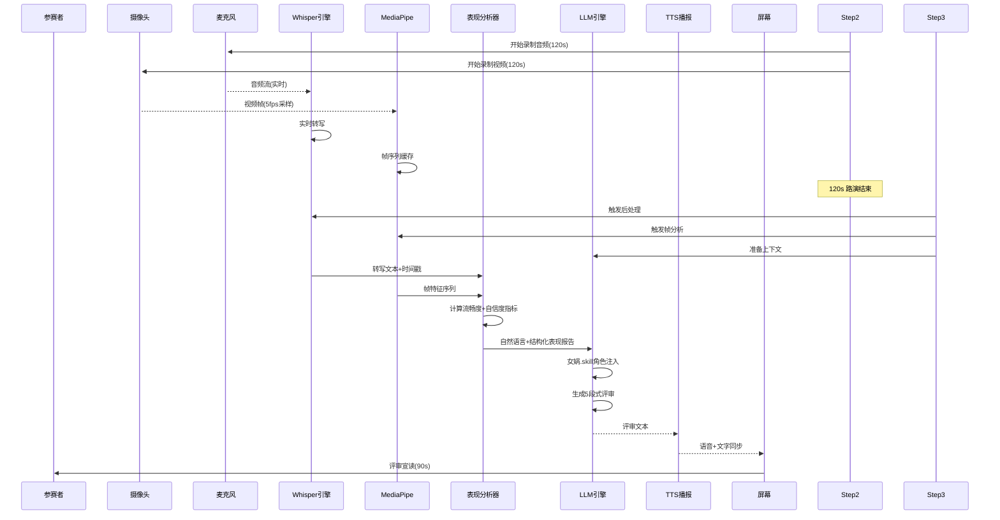

# 黑客松「传奇评审亭」— 详细实现方案

> **版本**: v1.1
> **日期**: 2026-06-17
> **更新说明**:
> - v1.0: 初版（含马斯克声线克隆 + 复杂自信度评分）
> - v1.1: 删除声线克隆（改用 Edge TTS）；简化自信度为情绪指标（MediaPipe 52 blendshapes）；补充开源项目拼接参考
> **目标**: Demo 阶段端到端可运行

---

## 目录

1. [项目结构与技术栈](#1-项目结构与技术栈)
2. [整体数据流](#2-整体数据流)
3. [语音管线详解](#3-语音管线详解)
4. [视觉管线详解](#4-视觉管线详解)
5. [演讲表现分析引擎](#5-演讲表现分析引擎)
6. [LLM 引擎与 Prompt 注入](#6-llm-引擎与-prompt-注入)
7. [信号质量与降级策略](#7-信号质量与降级策略)
8. [前端 UI 流程](#8-前端-ui-流程)
9. [输出物生成](#9-输出物生成)
10. [实现优先级与排期](#10-实现优先级与排期)
11. [开源项目拼接参考大全](#11-开源项目拼接参考大全)
12. [目录结构](#12-目录结构)

---

## 1. 项目结构与技术栈

### 1.1 技术选型

| 层级 | 技术 | 选型理由 |
|------|------|---------|
| **语言** | Python 3.11+ | AI/视觉生态最好，Whisper/MediaPipe 原生支持 |
| **Web 框架** | FastAPI | 异步 IO，适合多管线并行，热重载 |
| **前端** | React + TailwindCSS | 快速搭建 5 步 UI，倒计时动画 |
| **语音转写** | openai-whisper (small) | 本地运行，实时性好，精度足够 |
| **视觉分析** | MediaPipe Face Mesh + Holistic | 纯本地、跨平台、帧率好 |
| **LLM** | 云端 API（Claude/GPT） | 评审质量高，可使用女娲.skill |
| **TTS** | Edge TTS / Coqui TTS (本地) | Edge 免费高品质 or Coqui 本地化 |
| **合影** | OpenCV + Pillow | 自动拍照 + 图片叠加合成 |

### 1.2 整体架构图

```
┌──────────────────────────────────────────────────────────────────────┐
│                        评审亭客户端 (Python + FastAPI)                │
│                                                                      │
│  ┌─────────────────┐     ┌──────────────────┐     ┌──────────────┐  │
│  │  流程控制器      │     │  管线调度器       │     │  输出生成器   │  │
│  │  (State Machine) │────▶│  (Pipeline Mgr)  │────▶│  - 合影合成  │  │
│  │                  │     │                  │     │  - 二维码    │  │
│  │  Steps 1-5       │     │  A. Whisper      │     │  - H5 生成   │  │
│  │  倒计时管理       │     │  B. MediaPipe    │     └──────────────┘  │
│  │  画面切换         │     │  C. LLM          │                       │
│  └─────────────────┘     └──────────────────┘                       │
│         │                       │                                    │
│         ▼                       ▼                                    │
│  ┌──────────────────────────────────────────────────┐               │
│  │                共享数据总线                        │               │
│  │  audio_buffer │ video_frames │ analysis_results  │               │
│  └──────────────────────────────────────────────────┘               │
└──────────────────────────────────────────────────────────────────────┘
         │                              │
         ▼                              ▼
  ┌──────────────┐           ┌──────────────────┐
  │  前端浏览器   │           │  云端 API        │
  │  (React/SSE) │           │  LLM + TTS       │
  └──────────────┘           └──────────────────┘
```

---

## 2. 整体数据流

### 2.1 时间线（精确到秒）

```
Step 1 (入场)            Step 2 (路演)               Step 3 (思考)              Step 4 (宣读)           Step 5 (输出)
0s─10s                  10s─135s                    135s─165s                   165s─285s               285s─315s
│                        │                          │                           │                       │
│ 进入                   │ 摄像头+麦克风开始录制       │ 并行执行：                 │ TTS 播报              │ 自动拍照
│ 人脸检测               │ 实时显示倒计时              │  ├─ Whisper后处理 → 流畅度  │ 屏幕同步显示评审       │ 签名叠加
│ 欢迎语                 │ Whisper 流式转写           │  ├─ MediaPipe分析 → 自信度  │ 动画过渡              │ 二维码生成
│                        │ 视频帧缓存到环形缓冲区      │  └─ LLM 推理 → 评审报告    │                       │ 输出给用户
│                        │ 屏幕显示 "正在聆听…"       │ 思考动画                  │                       │
```

### 2.2 数据流示意



---

## 3. 语音管线详解

### 3.1 架构

```
麦克风(16kHz 16bit)
    │
    ▼
┌─────────────────────┐
│ 音频环形缓冲区        │  30s 环形缓冲，防止内存爆炸
│ (Ring Buffer 30s)   │
└─────────┬───────────┘
          │
          ▼
┌─────────────────────┐
│ Whisper Small        │  <-- 本地模型，实时转写
│ (实时模式)           │      max_frames_per_buffer=1600
└─────────┬───────────┘
          │
          ▼
┌─────────────────────┐
│ 转写文本队列          │  {text, start_time, end_time, confidence}
└─────────┬───────────┘
          │
          ▼ (路演结束后触发)
┌─────────────────────┐
│ 后处理分析器          │  → 流畅度报告
│ (PostProcessor)     │  → 全文转写文本
└─────────────────────┘
```

### 3.2 Whisper 配置

```python
# 配置参数
WHISPER_CONFIG = {
    "model": "small",             # 精度/速度平衡点
    "language": "zh",             # 中文优先
    "task": "transcribe",         # 转写模式（不翻译）
    "beam_size": 3,               # 束搜索宽度
    "vad_filter": True,           # VAD 过滤静音段
    "vad_threshold": 0.5,         # VAD 敏感度
    "sample_rate": 16000,         # 采样率
    "max_frame_buffer": 1600,     # 每帧采样数 (100ms)
}
```

### 3.3 后处理：流畅度分析算法

输入：Whisper 输出的带时间戳的 transcribe segments

```python
def analyze_fluency(segments: list[dict]) -> dict:
    """
    输入: [
        {"text": "我们这个项目是", "start": 0.5, "end": 1.2, "confidence": 0.95},
        {"text": "基于深度学习的", "start": 1.5, "end": 2.8, "confidence": 0.92},
        ...
    ]
    
    输出: 流畅度分析报告
    """
```

#### 3.3.1 核心指标计算

| 指标 | 计算方式 | 阈值参考 |
|------|---------|---------|
| **语速 (WPM)** | `总有效字数 ÷ 总有效时长 × 60` | 慢速 <120, 正常 120-200, 快速 >200 |
| **有效说话时长** | 总时长 - 总暂停时长 (>1.5s 间隔) | — |
| **停顿次数 (Pause Count)** | 相邻句间隔 >1.5s 的事件计数 | 少 <5, 正常 5-15, 多 >15 |
| **最长停顿** | max(句间隔) | 正常 <4s, 异常 >6s |
| **口头禅密度** | 匹配 "嗯/呃/啊/就是说/然后/那个/这个" 等 | 低 <3, 正常 3-10, 高 >10 |
| **磕巴事件** | 连续相同词/字重复（"我我我"、"就是就是"） | — |
| **语速波动率** | 每 10s 窗口的 WPM 标准差 | 平稳 <20, 波动 20-40, 剧烈 >40 |
| **流畅度综合分** | 加权综合（算法见下） | 0-100 |

#### 3.3.2 口头禅检测正则

```python
FILLER_PATTERNS = [
    r'嗯[嗯]*',       # 嗯 / 嗯嗯
    r'呃[呃]*',       # 呃 / 呃呃
    r'啊[啊]*',       # 啊 / 啊啊
    r'就是说',        # 就是说
    r'然后',          # 然后
    r'那个',          # 那个
    r'这个',          # 这个
    r'反正',          # 反正
    r'基本上',        # 基本上
    r'我觉得',        # 我觉得
    r'可能\b',        # 可能
    r'大概',          # 大概
]

STUTTER_PATTERNS = [
    r'(\S)\1{2,}',     # 同一个字连续3次以上（我我我）
    r'(\w{2,})\1{1,}', # 同一个词连续2次以上（就是就是）
]
```

#### 3.3.3 流畅度综合评分公式

```python
def calc_fluency_score(metrics: dict) -> int:
    """
    权重分配:
    - 语速正常度: 20% (是否在 120-200 WPM)
    - 停顿频率: 25% (过多停顿降分)
    - 口头禅密度: 25% (过多降分)
    - 语速波动: 20% (波动大降分)
    - 磕巴: 10% (有则降分)
    """
    score = 100
    
    # 语速惩罚
    if metrics['avg_wpm'] < 80: score -= 20
    elif metrics['avg_wpm'] < 120: score -= 10
    elif metrics['avg_wpm'] > 250: score -= 15
    elif metrics['avg_wpm'] > 200: score -= 5
    
    # 停顿惩罚 (每多一次停顿扣1分, 上限-15)
    pause_penalty = min(metrics['pause_count'] * 1.5, 15)
    score -= pause_penalty
    
    # 口头禅惩罚
    filler_penalty = min(metrics['filler_word_count'] * 2, 15)
    score -= filler_penalty
    
    # 波动惩罚
    if metrics['wpm_volatility'] > 40: score -= 15
    elif metrics['wpm_volatility'] > 25: score -= 8
    
    # 磕巴惩罚
    score -= metrics['stutter_count'] * 5
    
    return max(score, 0)
```

---

## 4. 视觉管线详解

### 4.1 架构

```
摄像头(30fps, 4K → 降采样至720p for 分析)
    │
    ▼
┌─────────────────────┐
│ 帧采样器              │  5fps 采一帧分析
│ (Sampler 5fps)      │  原始帧用于合影单拍
└─────────┬───────────┘
          │
          ▼
┌──────────────────────────────┐
│ Google MediaPipe FaceLandmark │  478 个 3D 面部关键点
│ (新版本 API: mp.tasks.vision) │  + 52 个 ARKit blendshapes ⭐
└─────────┬───────────────────┘
          │
          ▼
┌─────────────────────┐
│ 特征时序缓冲          │  每帧: landmarks + blendshapes + head_pose
│ (Buffer ~600帧)     │  120s × 5fps = 600帧
└─────────┬───────────┘
          │
          ▼ (路演结束后触发)
┌─────────────────────┐
│ 情绪指标提取器         │  → 从 52 blendshapes 提取关键情绪信号
│ (Emotion Extractor)  │  → 头部姿态分析
└─────────────────────┘
```

### 4.2 核心：MediaPipe Face Landmarker（Google 官方）

这是 **Google 开源的最新 API**（`mp.tasks.vision.FaceLandmarker`），相比旧版 `mp.solutions.face_mesh` 更简洁、更快、**直接输出 52 个 ARKit 表情系数**。

```python
# Google Face Landmarker 新 API 用法
import mediapipe as mp
from mediapipe.tasks import python
from mediapipe.tasks.python import vision

# 配置——核心是打开 blendshapes 输出
base_options = python.BaseOptions(model_asset_path='face_landmarker_v2.task')
options = vision.FaceLandmarkerOptions(
    base_options=base_options,
    running_mode=vision.RunningMode.VIDEO,
    num_faces=1,
    output_face_blendshapes=True,    # ⭐ 开启 52 ARKit blendshapes
    min_face_detection_confidence=0.7,
    min_tracking_confidence=0.6,
)
detector = vision.FaceLandmarker.create_from_options(options)

# 逐帧推理
landmarker_result = detector.detect_for_video(mp.Image(image_format=mp.ImageFormat.SRGB, data=frame), frame_timestamp_ms)

# 输出包含:
face_landmarks = landmarker_result.face_landmarks[0]       # 478 个 3D 关键点
face_blendshapes = landmarker_result.face_blendshapes[0]   # 52 个 blendshape 系数 ⭐
```

> **性能**：BlazeFace 检测器 ~3ms/帧（GPU），FaceMesh-V2 ~5ms/帧。5fps 采样下几乎零负载。

### 4.3 52 个 ARKit Blendshapes——情绪指标直接拿来用

MediaPipe Face Landmarker 输出的 52 个 blendshape 系数（0.0-1.0），**本身就是标准化的面部动作编码单元（FACS）**。我们只需要从中选取与"自信度/紧张度"相关的子集：

#### 4.3.1 关键情绪指标选取（只需 8 个）

| 指标 | Blendshape 名称 | 含义 | 与自信度的关系 |
|------|----------------|------|--------------|
| **紧张度** | `browInnerUp` | 眉头内提（皱眉） | ↑ 越高越紧张 |
| **紧张度** | `browOuterUp` | 眉头外提（惊讶） | ↑ 可能不安 |
| **紧张度** | `jawOpen` | 嘴巴微张 | ↑ 紧张/不知所措 |
| **紧张度** | `mouthPress` | 嘴唇紧抿 | ↑ 紧张/压抑 |
| **自信度** | `mouthSmileLeft` + `mouthSmileRight` | 微笑 | ↑ 越高越放松自信 |
| **自信度** | `eyeBlinkLeft` + `eyeBlinkRight` | 眨眼频率 | 高频眨眼 = 紧张 |
| **自信度** | `headPose` | 头部姿态（非blendshape，另算） | 稳定 = 自信 |

#### 4.3.2 情绪/自信度提取——极简实现

```python
def extract_emotion_signals(blendshapes_seq: list) -> dict:
    """
    从 52 blendshapes 序列中提取情绪信号
    只需要 8 个关键 blendshape + 简单统计
    """
    KEY_BLENDSHAPES = [
        'browInnerUp', 'browOuterUp',         # 紧张：眉头
        'jawOpen', 'mouthPress',               # 紧张：嘴部
        'mouthSmileLeft', 'mouthSmileRight',   # 自信：微笑
        'eyeBlinkLeft', 'eyeBlinkRight',       # 紧张：眨眼
    ]
    
    # 提取时序数据
    signals = {name: [] for name in KEY_BLENDSHAPES}
    for frame in blendshapes_seq:
        for bs in frame:
            if bs.category_name in signals:
                signals[bs.category_name].append(bs.score)
    
    # 时序统计
    emotion_signals = {}
    for name, values in signals.items():
        emotion_signals[f"{name}_mean"] = round(np.mean(values), 3)
        emotion_signals[f"{name}_max"] = round(max(values), 3)
        emotion_signals[f"{name}_var"] = round(np.var(values), 5)
    
    # 综合紧张指数 (0-1)
    tension = (
        emotion_signals['browInnerUp_mean'] * 0.25 +
        emotion_signals['browOuterUp_mean'] * 0.15 +
        emotion_signals['jawOpen_mean'] * 0.20 +
        emotion_signals['mouthPress_mean'] * 0.15 +
        calc_blink_rate(signals['eyeBlinkLeft'], signals['eyeBlinkRight']) * 0.25
    )
    
    # 综合微笑指数 (0-1)
    smile = (
        emotion_signals['mouthSmileLeft_mean'] * 0.5 +
        emotion_signals['mouthSmileRight_mean'] * 0.5
    )
    
    return {
        "tension_index": round(tension, 3),     # 0-1, 高=紧张
        "smile_index": round(smile, 3),          # 0-1, 高=自信
        "overall_emotion": judge_emotion(tension, smile),
        "raw_blendshapes": emotion_signals,      # 完整数据备查
    }


def calc_blink_rate(blink_left: list, blink_right: list) -> float:
    """
    计算眨眼频率——高频眨眼 = 紧张信号
    相邻帧眨眼值上升沿计数
    """
    # 阈值二值化
    blink = [max(l, r) > 0.6 for l, r in zip(blink_left, blink_right)]
    # 上升沿计数
    rate = sum(1 for i in range(1, len(blink)) if not blink[i-1] and blink[i])
    # 归一化到 0-1（假设最大 30 次/分钟）
    duration_min = len(blink) * FRAME_INTERVAL / 60
    return min(rate / max(duration_min * 30, 1), 1.0)


def judge_emotion(tension: float, smile: float) -> str:
    """将数值映射为自然语言标签"""
    if smile > 0.3 and tension < 0.4:
        return "relaxed_confident"
    elif smile > 0.1 and tension < 0.5:
        return "slightly_nervous"
    elif tension > 0.6:
        return "tense"
    elif tension > 0.4:
        return "slightly_tense"
    else:
        return "neutral"
```

### 4.4 头部姿态（除了情绪之外的补充指标）

用 BlazeFace 自带的 6 个关键点（不需要额外模型）直接估算：

```python
def estimate_head_pose(face_landmarks) -> dict:
    """从 478 点估算头部欧拉角"""
    # 5 个稳定点用于 PnP 求解
    image_points = np.array([
        face_landmarks[1],     # 鼻尖
        face_landmarks[152],   # 下巴
        face_landmarks[263],   # 右眼外角
        face_landmarks[33],    # 左眼外角
        face_landmarks[13],    # 上唇中点
    ], dtype=np.double)
    
    success, rotation_vector, translation_vector = cv2.solvePnP(
        MODEL_POINTS, image_points, CAMERA_MATRIX, DIST_COEFFS
    )
    
    # 旋转向量 → 欧拉角
    rmat, _ = cv2.Rodrigues(rotation_vector)
    pose_mat = np.hstack((rmat, translation_vector))
    _, _, _, _, _, _, angles = cv2.decomposeProjectionMatrix(pose_mat)
    
    return {
        "yaw": angles[0],       # 左右摇头
        "pitch": angles[1],     # 低头抬头
        "roll": angles[2],      # 歪头
    }


def analyze_gaze_stats(head_poses: list[dict]) -> dict:
    """从头部姿态序列统计眼神相关指标"""
    YAW_THRESHOLD = 30
    PITCH_THRESHOLD = 20
    
    looking_frames = sum(
        1 for hp in head_poses
        if abs(hp['yaw']) < YAW_THRESHOLD and abs(hp['pitch']) < PITCH_THRESHOLD
    )
    
    return {
        "gaze_at_camera_pct": round(looking_frames / len(head_poses) * 100, 1),
        "head_stability_score": round(
            max(0, 100 - (np.std([hp['yaw'] for hp in head_poses]) * 2)), 1
        ),
    }
```

### 4.5 最终情绪/自信度产出

一条管线跑完，产出非常轻量：

```python
# 最终产出（注入 LLM 用）
emotion_report = {
    "tension_index": 0.35,      # 0-1 紧张度
    "smile_index": 0.28,        # 0-1 微笑度
    "overall_emotion": "slightly_nervous",
    "gaze_at_camera_pct": 72.5,
    "head_stability_score": 68.3,
    "summary": "整体略微紧张，有一定微笑，眼神看镜头比例约七成",
}
```

**相比之前版本删除了**：复杂的自信度综合评分公式、小动作检测（EnvisionHGDetector 可选补充）、Holistic Pose 集成。

> **为什么这样做？** 真正的自信度是一个复杂的心理学概念，用 OpenCV 公式"算"是伪精确。不如直接给 LLM 原始情绪信号——让"马斯克"用自己的判断力去解读。太紧张他会说"你看起来不太自信"，微笑多他会说"你好像还挺得意"。

---

## 5. 演讲表现分析引擎

### 5.1 统一分析输出结构

这是整个管线产出的最终数据结构——**直接注入 LLM Prompt 的核心**。

```python
# 最终输出: 表现分析报告
PerformanceReport = {
    "quality": {
        "video_tracking_quality": "good" | "degraded" | "poor",
        "audio_quality": "good" | "degraded" | "poor",
        "signal_note": str,  # 降级说明
    },
    "fluency": {
        "score": int,                  # 0-100
        "avg_wpm": float,              # 平均语速
        "pause_count": int,            # 停顿次数
        "longest_pause_seconds": float,
        "filler_word_count": int,
        "filler_examples": list[str],  # 示例: ["就是说", "嗯"]
        "stutter_count": int,
        "wpm_volatility": float,       # 语速波动率
        "summary": str,                # 自然语言概述
    },
    "emotion": {
        "tension_index": float,          # 0-1 紧张度
        "smile_index": float,            # 0-1 微笑度
        "overall_emotion": str,          # "relaxed_confident" | "slightly_nervous" | "tense" | "neutral"
        "gaze_at_camera_pct": float,     # 看镜头比例
        "head_stability_score": float,   # 头部稳定度
        "summary": str,                  # 一句话概述
    },
}
```

### 5.2 信号质量评估

视觉分析开始前先评估画面质量，决定是否降级：

```python
def assess_video_quality(frame_features: list[dict]) -> str:
    """
    - face_detected_ratio: 人脸被成功追踪的帧比例
    - avg_detection_confidence: 平均置信度
    - lighting_assessment: 基于帧亮度的粗略判断
    
    返回: "good" / "degraded" / "poor"
    """
    detect_frames = sum(1 for f in frame_features if f['face_detected'])
    detect_ratio = detect_frames / len(frame_features) if frame_features else 0
    
    if detect_ratio > 0.85:
        return "good"
    elif detect_ratio > 0.50:
        return "degraded"
    else:
        return "poor"
```

### 5.3 自然语言概述生成

将结构化指标转换为 LLM 友好的自然语言段落（模板驱动）：

```python
def generate_fluency_narrative(fluency: dict) -> str:
    parts = []
    
    wpm = fluency['avg_wpm']
    if wpm < 100: parts.append(f"语速偏慢（{wpm}词/分钟），可能不太熟练")
    elif wpm < 140: parts.append(f"语速适中偏慢（{wpm}词/分钟）")
    elif wpm < 200: parts.append(f"语速适中（{wpm}词/分钟）")
    else: parts.append(f"语速偏快（{wpm}词/分钟），可能有点紧张")
    
    if fluency['pause_count'] > 10:
        parts.append(f"出现了{fluency['pause_count']}次停顿，最长{fluency['longest_pause_seconds']}秒")
    
    if fluency['filler_word_count'] > 5:
        examples = "、".join(set(fluency['filler_examples']))
        parts.append(f"使用了{fluency['filler_word_count']}次口头禅（如\"{examples}\"）")
    
    if fluency['stutter_count'] > 0:
        parts.append(f"有{fluency['stutter_count']}次磕巴")
    
    return "。".join(parts) + "。"


def generate_emotion_narrative(emotion: dict) -> str:
    parts = []
    
    # 情绪标签 → 中文描述
    emotion_map = {
        "relaxed_confident": "整体表现放松自信",
        "slightly_nervous": "略微紧张",
        "tense": "明显紧张",
        "slightly_tense": "有些紧张",
        "neutral": "情绪表现平稳",
    }
    parts.append(emotion_map.get(emotion['overall_emotion'], "情绪表现平稳"))
    
    # 紧张度细节
    if emotion['tension_index'] > 0.6:
        parts.append(f"面部肌肉紧张度高（{emotion['tension_index']:.2f}）")
    elif emotion['tension_index'] > 0.4:
        parts.append(f"有一定紧张感（{emotion['tension_index']:.2f}）")
    else:
        parts.append(f"面部表情自然放松")
    
    # 微笑程度
    if emotion['smile_index'] > 0.3:
        parts.append("有自然的微笑")
    elif emotion['smile_index'] > 0.1:
        parts.append("偶尔有微笑")
    
    # 眼神
    gaze = emotion['gaze_at_camera_pct']
    if gaze < 40:
        parts.append(f"看镜头较少（{gaze}%），目光回避偏多")
    elif gaze < 65:
        parts.append(f"看镜头比例一般（{gaze}%）")
    else:
        parts.append(f"大部分时间能直视摄像头（{gaze}%）")
    
    return "。".join(parts) + "。"
```

### 5.4 注入 Prompt 的最终格式

```json
{
  "role": "user",
  "content": [
    {
      "type": "text",
      "text": "以下是黑客松参赛者的项目介绍（语音转写文本）：\n{whisper_full_text}"
    },
    {
      "type": "text",
      "text": "---\n\n此外，以下是该参赛者在路演过程中的表现分析，如果观察到了有趣的现象，可以在评审中适当提及，但不要过度占据篇幅：\n\n【演讲流畅度】\n{fluency_narrative}\n\n【情绪与自信度】\n{emotion_narrative}\n\n---\n\n请以埃隆·马斯克的风格，按照以下结构输出评审报告：\n1. 一句话本质洞察（不超过25字）\n2. 2-3个具体的硬核亮点\n3. 1个尖锐的第一性原理问题\n4. 1-2条可执行的硬核建议\n5. 一句结语"
    }
  ]
}
```

---

## 6. LLM 引擎与 Prompt 注入

### 6.1 女娲.skill 集成

女娲.skill 负责角色定义和人格注入。预期接口：

```python
# 伪代码：女娲.skill 接口约定
from nvwa import SkillPersona, generate_with_persona

persona = SkillPersona.load("elon_musk")  # 马斯克角色定义

# 调用
response = generate_with_persona(
    persona=persona,
    system_prompt=SYSTEM_PROMPT_TEMPLATE,
    user_messages=[{
        "whisper_output": transcribed_text,
        "performance_analysis": fluency_narrative + "\n" + confidence_narrative,
    }],
    output_structure=REVIEW_SCHEMA,
)
```

### 6.2 评审输出 Schema

```python
REVIEW_SCHEMA = {
    "type": "object",
    "properties": {
        "insight": {
            "type": "string",
            "description": "一句话本质洞察（≤25字）",
            "maxLength": 25
        },
        "highlights": {
            "type": "array",
            "items": {"type": "string"},
            "minItems": 2,
            "maxItems": 3,
            "description": "2-3个硬核亮点"
        },
        "sharp_question": {
            "type": "string",
            "description": "1个尖锐的第一性原理问题"
        },
        "suggestions": {
            "type": "array",
            "items": {"type": "string"},
            "minItems": 1,
            "maxItems": 2,
            "description": "1-2条可执行的硬核建议"
        },
        "closing": {
            "type": "string",
            "description": "一句结语（马斯克风格）"
        }
    },
    "required": ["insight", "highlights", "sharp_question", "suggestions", "closing"]
}
```

### 6.3 TTS 播报

```python
# 将结构化评审报告展平为文本，送 TTS
def render_review_for_tts(review: dict) -> str:
    lines = []
    lines.append("好，我看完了。让我用第一性原理拆解你的项目。")
    lines.append("")
    lines.append(f"一句话：{review['insight']}")
    lines.append("")
    lines.append("说几个亮点：")
    for i, h in enumerate(review['highlights'], 1):
        lines.append(f"第{i}，{h}")
    lines.append("")
    lines.append(f"但是，我要问一个尖锐的问题：{review['sharp_question']}")
    lines.append("")
    lines.append("我建议你考虑：")
    for s in review['suggestions']:
        lines.append(f"- {s}")
    lines.append("")
    lines.append(f"最后：{review['closing']}")
    return "\n".join(lines)
```

TTS 方案：

| 方案 | 延迟 | 音质 | 中文 | 本地 | 推荐度 |
|------|------|------|------|------|--------|
| Edge TTS (免费) | 低 | 高 | 好 | 否（网络） | ⭐⭐⭐⭐⭐（**优先采用**） |
| OpenAI TTS | 低 | 高 | 好 | 否 | ⭐⭐⭐⭐（备选） |

> **注意**：不需要马斯克声线克隆。采用 **Edge TTS** 免费 API，选一个沉稳的中文男性音色即可。评审内容才是核心体验，声音只要自然清晰就够。

---

## 7. 信号质量与降级策略

### 7.1 降级触发条件

| 条件 | 表现 | 降级动作 |
|------|------|---------|
| Face Mesh 追踪率 < 50% | 画面太暗 / 用户侧身 / 戴遮挡物 | 自信度全指标禁用，使用默认值 |
| Face Mesh 追踪率 50-85% | 部分帧丢失 | 自信度部分指标降级 |
| Whisper confidence < 0.6 | 录音质量差 / 噪音大 | 手动输入后备 |
| Whisper 完全失败 | 无声 / 严重噪声 | 触发手动输入弹窗 |

### 7.2 降级逻辑

```python
def decide_degradation(frame_features: list, whisper_confidence: float) -> PerformanceReport:
    video_quality = assess_video_quality(frame_features)
    audio_quality = "good" if whisper_confidence > 0.6 else "degraded"
    
    report = PerformanceReport(
        quality=SignalQuality(video_quality, audio_quality),
    )
    
    # 流畅度分析——音频质量不好则不准
    if audio_quality == "degraded":
        report.fluency = FluencyReport(
            score=50,
            summary="音频质量不佳，流畅度分析仅供参考",
            **default_fallback_values
        )
    else:
        report.fluency = run_fluency_analysis(...)
    
    # 自信度分析——视频不好则降级
    if video_quality == "poor":
        report.confidence = ConfidenceReport(
            score=50,
            summary="视频信号不足（光线/遮挡），自信度分析未启用",
            **default_fallback_values
        )
        report.quality.signal_note = "自信度分析禁用：人脸追踪率低于50%"
    elif video_quality == "degraded":
        report.confidence = run_degraded_confidence_analysis(...)
        report.quality.signal_note = "自信度分析受限：部分指标降级"
    else:
        report.confidence = run_full_confidence_analysis(...)
    
    return report
```

### 7.3 降级时的注入处理

如果自信度被降级，Prompt 中对应段落变为：

```
【演讲自信度】
（自信度分析因视频信号不足未启用，仅从语音判断：{fluency_only_comment}）
```

LLM 收到这个信息就知道不要强行评价用户的表情和眼神。

---

## 8. 前端 UI 流程

### 8.1 路由与状态机

```
URL: /booth

状态: WELCOME → PRESENTING → THINKING → REVIEWING → PHOTO → COMPLETE

WELCOME:     10s 倒计时 → 人脸检测检测 → 自动进入
PRESENTING:  120s 倒计时 → 摄像头红灯 → "正在聆听…" 
             → 实时显示音量波形（可选）
THINKING:    25-30s 动画 → "用第一性原理拆解中…"
             → 后台跑 3 条管线
REVIEWING:   90-120s → TTS + 文字逐段同步显示
             → 进度指示
PHOTO:       自动拍 3 张选最佳 → 叠签 → 显示预览
COMPLETE:    显示二维码 → "扫码带走你的评审报告"
```

### 8.2 技术选型

```json
{
  "frontend": {
    "framework": "React 18 + Vite",
    "language": "TypeScript",
    "styling": "TailwindCSS + Framer Motion (动画)",
    "state": "Zustand (状态机)",
    "backend_comm": "SSE (Server-Sent Events)",
    "camera_access": "WebRTC getUserMedia",
    "audio_capture": "MediaRecorder API → Blob → 上传"
  }
}
```

### 8.3 前端摄像头 vs 独立 Python 摄像头

> **建议方案**：Python 后台直接控制 USB 摄像头，前端只负责 UI。
> 原因：
> 1. 4K USB 摄像头在 Python 中通过 OpenCV 控制更可靠
> 2. 视频帧可直接传给 MediaPipe，无需经过浏览器
> 3. 音频直接走 Python 音频管线，避免 WebRTC 编码解码延迟
> 4. 合影拍照在 Python 端更可控

```
架构: Python FastAPI ←HTTP / SSE→ React Frontend
          │
          ├── OpenCV → 摄像头 (4K)
          ├── pyaudio → 麦克风
          ├── Whisper
          ├── MediaPipe
          └── LLM API
```

前端通过 SSE 接收状态更新（当前 step、倒计时、思考动画进度、评审文本流式输出等）。

---

## 9. 输出物生成

### 9.1 合影合成

```python
# 使用 OpenCV 拍照 → Pillow 叠加签名
def compose_photo(frame: np.ndarray, review: dict, event_logo: str) -> Image:
    """
    1. 从视频中选择最佳帧（笑容检测 + 眼睛睁开 + 清晰度）
    2. 调整尺寸 1920x1080
    3. 叠加"马斯克"手写签名 PNG (右下角 30% 透明)
    4. 叠加活动 Logo (左上角)
    5. 底部叠加一句评审摘录（如 "你做的这个……不算差。"）
    6. 右下角叠加二维码区域
    """
    img = cv2.cvtColor(frame, cv2.COLOR_BGR2RGB)
    pil_img = Image.fromarray(img)
    
    # 签名
    signature = Image.open("assets/musk_signature.png").convert("RGBA")
    signature = signature.resize((300, 100))
    pil_img.paste(signature, (1600, 50), signature)
    
    # 底部文字
    draw = ImageDraw.Draw(pil_img)
    font = ImageFont.truetype("assets/font.ttf", 36)
    draw.text((50, 1000), review['closing'], font=font, fill="white")
    
    return pil_img
```

### 9.2 二维码 H5

```python
# H5 为单页静态 HTML，嵌入所有内容
def generate_h5(review: dict, performance: dict, photo_base64: str) -> str:
    """
    单 HTML 文件包含:
    1. 项目信息（从输入获取）
    2. 完整评审报告
    3. 合影
    4. 演讲表现雷达图（Chart.js CDN）
    5. 分享按钮
    6. 自定义字体确保马斯克风格渲染
    
    上传到 CDN / OSS，返回 URL → 生成二维码
    """
    pass
```

### 9.3 二维码生成

```python
import qrcode

def generate_qr(url: str) -> Image:
    qr = qrcode.QRCode(box_size=5, border=2)
    qr.add_data(url)
    return qr.make_image(fill_color="black", back_color="white")
```

---

## 10. 实现优先级与排期

### 10.1 分阶段排期

| 阶段 | 目标 | 工作项 | 估时 |
|------|------|--------|------|
| **P0 核心闭环** | 5步流程可走完 | 前后端框架、Whisper 管线、LLM 接入、TTS、合影拍照 | 4-5天 |
| **P1 流畅度分析** | 演讲流畅度可算 | Whisper 后处理、口头禅检测、流畅度评分 | 1天 |
| **P2 情绪分析** | 从面部提取情绪信号 | MediaPipe FaceLandmarker 集成、52 blendshapes 提取、头部姿态 | 1天 |
| **P2 表现注入** | LLM 可参考表现数据 | Prompt 调优、自然语言生成、边界测试 | 1天 |
| **P3 打磨调优** | 体验流畅 | 动画优化、降级测试、性能调优 | 1-2天 |

### 10.2 P0 子任务分解

| 序号 | 任务 | 产出 |
|------|------|------|
| P0-1 | 搭建 FastAPI 项目骨架 + SSE + 状态机 | Step 1-5 可切换 |
| P0-2 | React 前端 5 页面 + 倒计时 + 动画 | UI 可用 |
| P0-3 | 4K 摄像头调用 + 麦克风录制 + 前端预览 | 音视频采集 |
| P0-4 | Whisper small 集成 + 实时转写 | 转写文本 |
| P0-5 | LLM API 接入 + 女娲.skill + 评审 Schema | 评审报告 |
| P0-6 | TTS 接入 + 前端逐段同步 | 语音播报 |
| P0-7 | 合影自动拍照 + 签名合成 + 二维码 | 输出物 |

### 10.3 工时估算

```
P0 核心闭环: 4-5天 (多人并行可压缩)
P1 流畅度:  +1天
P2 自信度:  +2天
P3 打磨:    +1-2天
-------------------
总计:       8-10天 (单人) / 5-6天 (2人并行)
```

---

### 10.4 更新后的完成估时

由于简化了自信度逻辑（去掉复杂公式，直接用 blendshapes）和 TTS（去掉声线克隆），工时进一步压缩：

```
P0 核心闭环: 4-5天
P1 流畅度:  +1天  
P2 情绪分析: +1天 (原自信度分析从 2天 降到 1天)
P3 打磨:    +1天
-------------------
总计:       7-8天 (单人) / 4-5天 (2人并行)
```

---

## 11. 开源项目拼接参考大全

### 11.1 项目总览

| 模块 | 开源项目 | 复用程度 | 集成方式 |
|------|---------|---------|---------|
| **STT 实时转写** | [docker-whisper-live](https://github.com/hwdsl2/docker-whisper-live) | >90% | Docker Compose 一键启动，WebSocket 接收 |
| **面部关键点+情绪** | [Google MediaPipe FaceLandmarker](https://developers.google.com/edge/mediapipe/solutions/vision/face_landmarker) (新版 API) | 100% | `pip install mediapipe` 自带 52 blendshapes |
| **演讲视觉分析** | [video_meeting_analyzer](https://github.com/ruitaocchen10/video_meeting_analyzer) | ~70% | 复用 camera.py 的姿态/眼神/手势检测逻辑 |
| **演讲头部姿态** | [PABLO](https://github.com/AlexanderAmpuero/QHacks_2025) | ~50% | 取 head_euler 计算逻辑 |
| **PPT 手势控制** | [Turner](https://github.com/LZDXN/Turner) | 参考 | 取后台 FastAPI + SSE + 前端分离架构 |
| **合影拍照** | [ITLab-CC/photobooth](https://github.com/ITLab-CC/photobooth) | ~60% | 复用拍照+渲染管线，改前端为 React |
| **Photo Booth** | [photobooth-app](https://github.com/photobooth-app/photobooth-app) | ~40% | 参考 QR 码、滤镜、自启动逻辑 |
| **TTS 播报** | Edge TTS (免费API) | 100% | `pip install edge-tts` 直接调用 |
| **真实时情绪识别** | [live-expression-reader](https://github.com/Arjun10g/live-expression-reader) | 参考 | 浏览器端 HSEmotion ONNX 的 52 blendshapes+8 情绪方案 |
| **手势检测** | [EnvisionHGDetector](https://github.com/WimPouw/envisionhgdetector) | P3 可选 | `pip install envisionhgdetector` |

### 11.2 推荐拼接策略

**最简可行方案（P0+P1，3人×3天可出）**：
```
docker-whisper-live (Docker STT)
    + MediaPipe FaceLandmarker (478点 + 52 blendshapes) 
    + Edge TTS (语音播报)
    + 我们自己写: 流程控制器 + LLM 调用 + 合影
```

**完整方案（P0+P1+P2，3人×5天）**：
```
docker-whisper-live (STT)
    + video_meeting_analyzer (复用 camera.py 姿态检测)
    + MediaPipe FaceLandmarker (52 blendshapes 情绪)
    + PABLO (头部欧拉角参考)
    + ITLab-CC/photobooth (合影输出参考)
    + Edge TTS (语音)
    + 我们自己写: LLM + 流程控制
```

### 11.3 不需要从零写的理由

| 以前以为要写 | 实际引用 | 代码量节省 |
|------------|---------|-----------|
| Whisper 流式服务端 | `docker-whisper-live` 直接 Docker 跑 | ~300行 |
| 面部关键点检测算法 | Google 官方 `FaceLandmarker` 一行代码 | ~500行 |
| 姿态/手势/眼神分析 | `video_meeting_analyzer` 复制 `camera.py` | ~400行 |
| TTS 声线克隆 | 直接 Edge TTS | ~1000行 |
| 拍照+QR输出 | `ITLab-CC/photobooth` 管线参考 | ~300行 |

所以核心团队只需专注写：**流程控制 + LLM 评审逻辑 + 合影渲染 + Prompt 工程** 这四个核心差异点。

---

## 12. 目录结构

```
hks/
├── backend/
│   ├── main.py                  # FastAPI 入口 + 状态机路由
│   ├── config.py                # 全局配置
│   ├── models/
│   │   ├── session.py           # Session 数据模型
│   │   ├── review.py            # 评审报告 Schema
│   │   └── performance.py       # 表现分析数据结构
│   ├── pipelines/
│   │   ├── audio/
│   │   │   ├── recorder.py      # 麦克风录制
│   │   │   ├── whisper_engine.py # Whisper 转写
│   │   │   └── fluency_analyzer.py # 流畅度分析 (P1)
│   │   ├── video/
│   │   │   ├── camera.py        # 摄像头控制
│   │   │   ├── mediapipe_engine.py # MediaPipe FaceLandmarker (P2)
│   │   │   └── emotion_analyzer.py # 情绪指标提取 (P2) ⭐ 简化版
│   │   ├── llm/
│   │   │   ├── llm_engine.py    # LLM API 调用
│   │   │   ├── persona.py       # 女娲.skill 集成
│   │   │   └── prompt_builder.py # Prompt 组装
│   │   ├── tts/
│   │   │   └── tts_engine.py    # Edge TTS
│   │   └── output/
│   │       ├── photo_composer.py # 合影合成
│   │       ├── qr_generator.py   # 二维码
│   │       └── h5_generator.py   # H5 页面生成
│   ├── services/
│   │   ├── pipeline_orchestrator.py # 三管线调度器
│   │   ├── signal_quality.py    # 信号质量评估 (P2)
│   │   └── degradation.py       # 降级策略 (P2)
│   └── assets/
│       ├── musk_signature.png   # 马斯克签名
│       └── event_logo.png       # 活动 Logo
├── frontend/
│   ├── src/
│   │   ├── App.tsx
│   │   ├── stores/
│   │   │   └── boothStore.ts    # Zustand 状态机
│   │   ├── pages/
│   │   │   ├── Welcome.tsx      # Step 1
│   │   │   ├── Presenting.tsx   # Step 2
│   │   │   ├── Thinking.tsx     # Step 3
│   │   │   ├── Reviewing.tsx    # Step 4
│   │   │   └── PhotoOutput.tsx  # Step 5
│   │   ├── components/
│   │   │   ├── Countdown.tsx    # 倒计时组件
│   │   │   ├── CameraPreview.tsx# 摄像头预览
│   │   │   ├── ReviewCard.tsx   # 评审卡片
│   │   │   └── QRDisplay.tsx    # 二维码展示
│   │   └── hooks/
│   │       └── useBoothSSE.ts   # SSE 连接
│   └── package.json
├── PRD.md
├── IMPLEMENTATION.md
└── README.md
```
